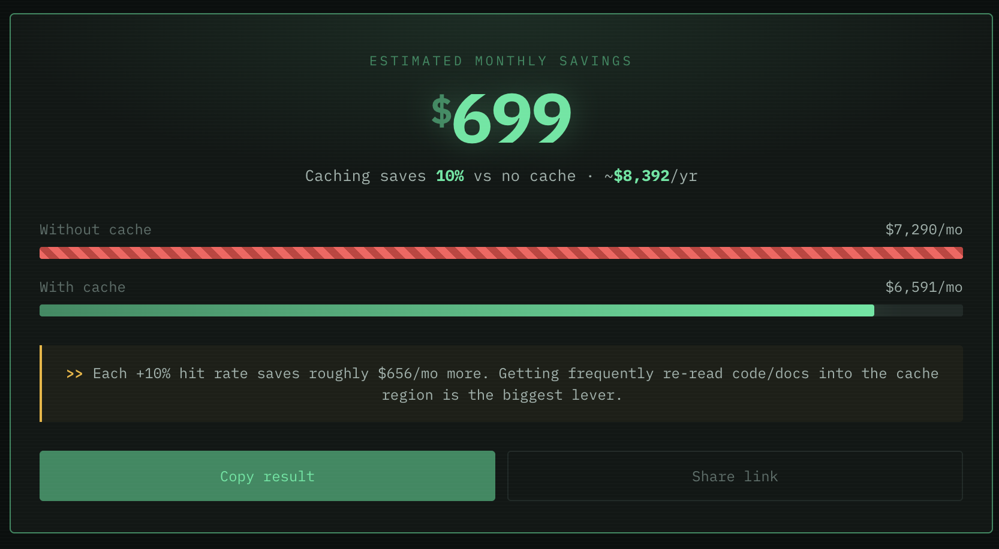

# Claude Cache Calculator

**See how much Claude prompt caching saves you per month — in 30 seconds.**

🔗 **Live:** [claude-cache-calculator.vercel.app](https://claude-cache-calculator.vercel.app/) · 🌏 [中文版](https://claude-cache-calculator.vercel.app/zh.html)



Everyone says *"turn on prompt caching to save money."* Nobody tells you **how much** for *your* usage — or when 1-hour TTL quietly costs you more. This tool answers both: pick a workload, drag a few sliders, and see your real monthly savings plus the break-even between 5-minute and 1-hour caching.

---

## Features

- **Scenario presets** — Scripts & tools / API integration / Data analysis, or fully custom
- **Live cost comparison** — *with cache* vs *without cache*, monthly + annual
- **5-min vs 1-hour TTL** — quantifies whether the 2× write cost pays off
- **Contextual hints** — dynamic advice based on your hit rate and TTL
- **Three models** — Opus 4.8 / Sonnet 4.6 / Haiku 4.5
- **Shareable links** — encode your inputs in the URL
- No signup, no backend, no tracking

## How the math works

Claude prompt caching has an asymmetric price structure (relative to base input price):

| Operation | Multiplier |
|-----------|-----------|
| Cache **read** (hit / refresh) | **0.1×** (90% off) |
| Cache **write**, 5-min TTL | **1.25×** |
| Cache **write**, 1-hour TTL | **2×** |

So caching only wins once your cached context is **re-read enough times** to earn back the write premium. The calculator models a month of usage:

```
monthlyInputTokens  = turns/day × 30 × contextSize × turnsPerConversation × utilization
monthlyOutputTokens = turns/day × 30 × contextSize × outputRatio × turnsPerConversation

costNoCache  = monthlyInputTokens × inputPrice + monthlyOutputTokens × outputPrice
costWithCache = monthlyInputTokens × hitRate × readPrice
              + monthlyInputTokens × (1 − hitRate) × writePrice
              + monthlyOutputTokens × outputPrice

savings = costNoCache − costWithCache
```

### Assumptions & limitations

This is an **estimate**, not a billing simulator. It assumes:
- A stable cacheable context region re-read across turns
- Output tokens are unaffected by caching (charged the same either way)
- A single model for the whole workload

Real costs vary with conversation structure, cache eviction, and how your prompt is ordered. Treat the numbers as a directional guide.

## Pricing data

Based on official [claude.com/pricing](https://claude.com/pricing), **last updated 2026-06-01**.

| Model | Input | Output | Cache write (5m / 1h) | Cache read |
|-------|-------|--------|-----------------------|-----------|
| Opus 4.8 | $5 | $25 | $6.25 / $10 | $0.50 |
| Sonnet 4.6 | $3 | $15 | $3.75 / $6 | $0.30 |
| Haiku 4.5 | $1 | $5 | $1.25 / $2 | $0.10 |

*All prices per million tokens (MTok).*

## Tech stack

Pure static frontend — a single `index.html` with no dependencies and no build step. Deployed on Vercel.

```
index.html     # English (default)
zh.html        # Chinese
robots.txt
sitemap.xml
og-image.png
```

## Local development

No tooling required — just open the file:

```bash
git clone https://github.com/Cicadaca/claude-cache-calculator.git
cd claude-cache-calculator
open index.html        # or: python3 -m http.server 8000
```

## Contributing

Pricing changes often — if you spot an outdated number, open a PR editing the `MODELS` object in `index.html` (and `zh.html`) and bump the "updated" date. Issues and feature requests welcome.

## License

MIT
